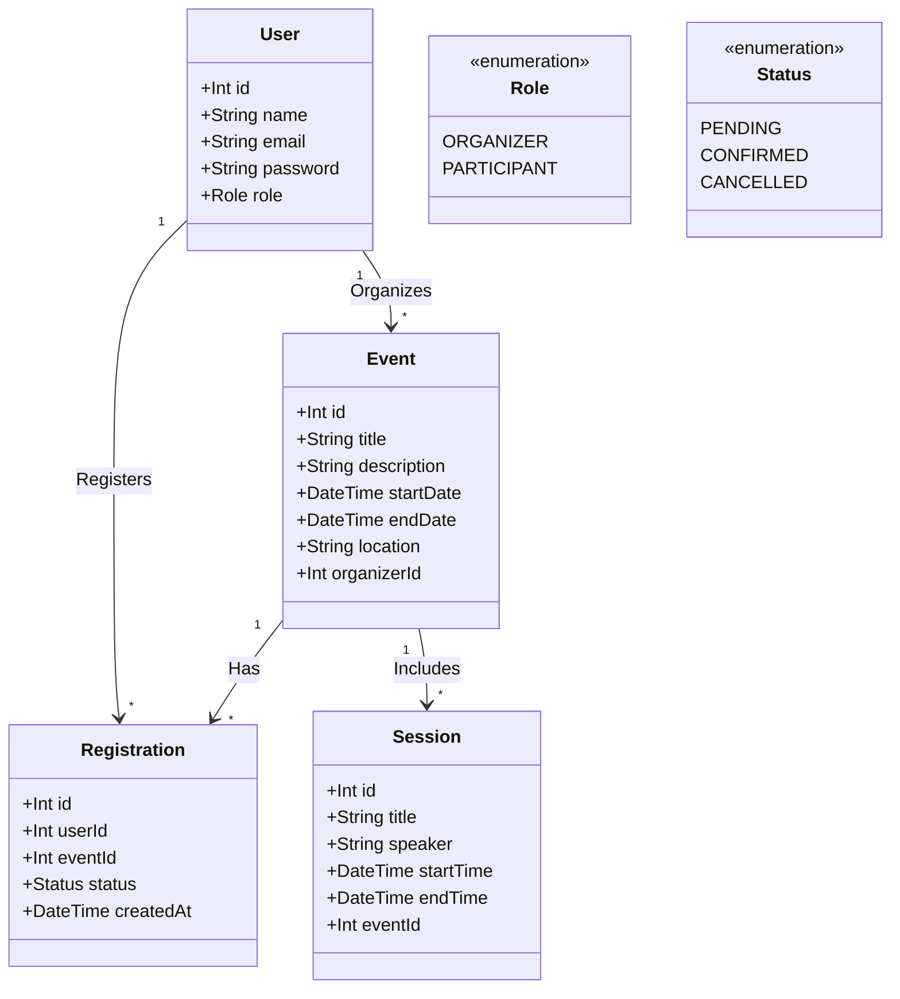

# Diagramme de Classes / Modèle de Données

```mermaid
classDiagram
    class User {
        +Int id
        +String name
        +String email
        +String password
        +Role role
    }

    class Event {
        +Int id
        +String title
        +String description
        +DateTime startDate
        +DateTime endDate
        +String location
        +Int organizerId
    }

    class Registration {
        +Int id
        +Int userId
        +Int eventId
        +Status status
        +DateTime createdAt
    }

    class Session {
        +Int id
        +String title
        +String speaker
        +DateTime startTime
        +DateTime endTime
        +Int eventId
    }

    User "1" --> "*" Event : Organizes
    User "1" --> "*" Registration : Registers
    Event "1" --> "*" Registration : Has
    Event "1" --> "*" Session : Includes

    class Role {
        <<enumeration>>
        ORGANIZER
        PARTICIPANT
    }

    class Status {
        <<enumeration>>
        PENDING
        CONFIRMED
        CANCELLED
    }
```
