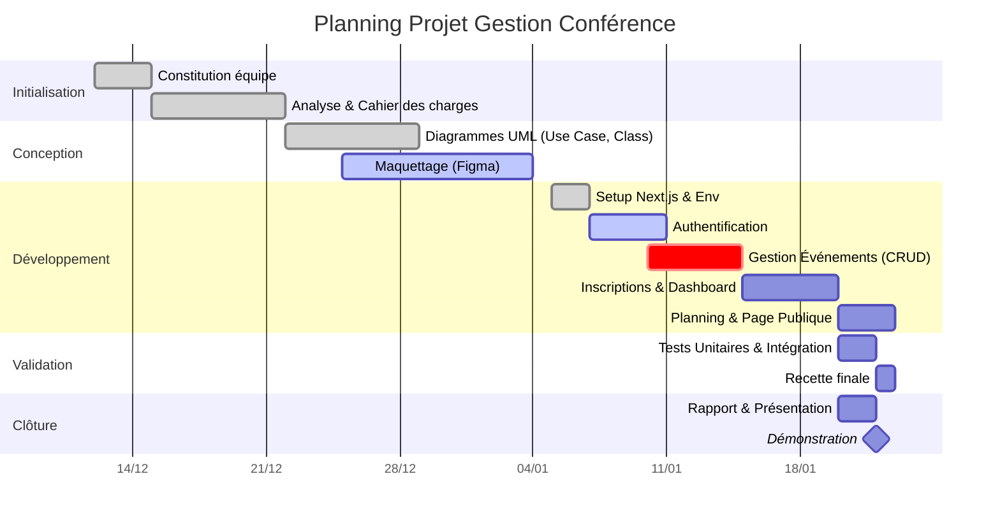

# Project Schedule (Gantt)

```mermaid
gantt
    title Planning Projet Gestion Conférence
    dateFormat  YYYY-MM-DD
    axisFormat  %d/%m

    section Initialisation
    Constitution équipe       :done, init1, 2025-12-12, 3d
    Analyse & Cahier des charges :done, init2, after init1, 7d
    
    section Conception
    Diagrammes UML (Use Case, Class) :done, des1, 2025-12-22, 7d
    Maquettage (Figma)        :active, des2, 2025-12-25, 10d
    
    section Développement
    Setup Next.js & Env       :done, dev1, 2026-01-05, 2d
    Authentification          :active, dev2, 2026-01-07, 4d
    Gestion Événements (CRUD) :crit, dev3, 2026-01-10, 5d
    Inscriptions & Dashboard  :dev4, after dev3, 5d
    Planning & Page Publique  :dev5, after dev4, 3d

    section Validation
    Tests Unitaires & Intégration :test1, 2026-01-20, 2d
    Recette finale            :test2, after test1, 1d

    section Clôture
    Rapport & Présentation    :doc1, 2026-01-20, 2d
    Démonstration             :milestone, 2026-01-22, 0d
```
